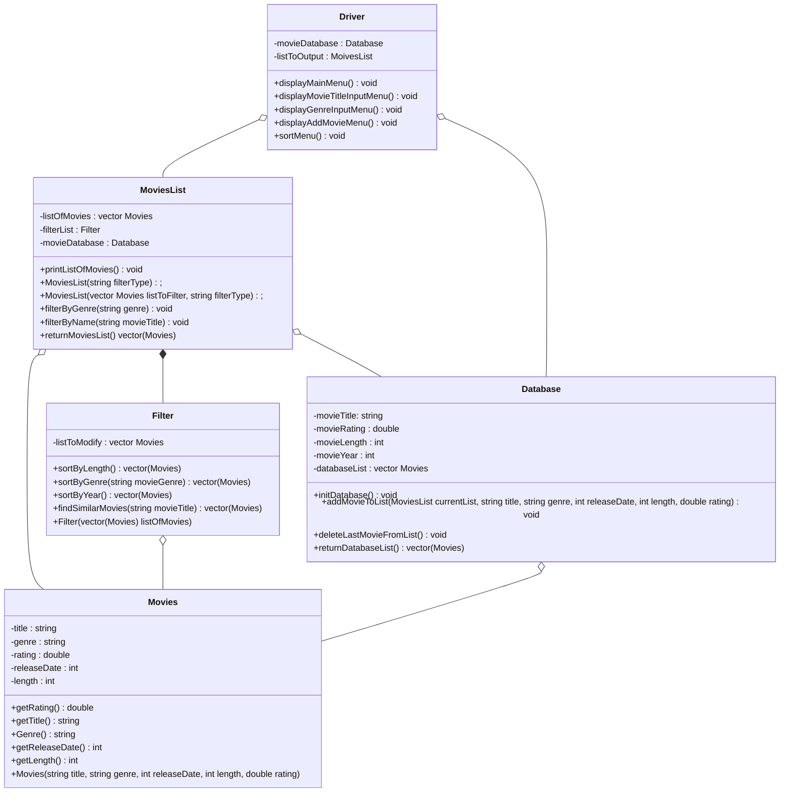

# Movie Recommender
 
 [Shan Santhakumar](https://github.com/ssant096), [Tim Cheung](https://github.com/tcheu024), [Hirsch Chheda](https://github.com/Hirschheda), [Yash Singhal](https://github.com/ysinghal03)

## Project Description
 Our team is proposing to make a Movie Recommender. We choose this as our project because we felt that a movie recommender involves elements we have learned about in our previous classes such as sorting algorithms. This particular project will also allow us to create and incorporate multiple classes that we can use together to give the user the best possible prediction of what movies they like to watch. 
 
 We plan to use C++ as the primary language for the project and our choice of IDE is going to be VSCODE. This is because we also plan on using Valgrind as our primary debugging tool to fix memory leaks and other errors that may occur during production.

 The input of our project will be movie genres, movie titles, and a method of sorting (by release date or rating for example). The output will be a collection of movies with ratings and the release year. 

 Our project will allow users to search for movies based on genre and also display a list of recommended similar movies based off of a user entered movie title. Lastly, all of the displayed movies will have the option of being sorted by either rating, release date or length. 

## Class Diagram
 For our project, we will have 5 classes: MoviesList, Movies, Filter, Driver, and Database. The MoviesList class will hold the main list of movies that will be output to the user. The Filter class will sort a list of movies input into it and return a sorted list of movies. The Movies class will will be used to construct each indiviual movie with all needed variables. The Database class will read data from a csv file and create a list of movies with that data, while also being capable of adding, removing, and saving movies from that list. Finally, the Driver class will handle all output to the user. The MoviesList class will construct a list of movies using data from the Database class and then use the Filter class to filter the list of Movies to suit the user's preferences based off of the user inputs, given the options output by the Driver class. The user will be able to choose a movie genre or enter a movie title to find similar movies and can sort the displayed movies by either release date, length, or rating. The user will do all of this with the guidance of output displayed by the Driver class.
 
 

 
 ## Screenshots
 

 ## Installation/Usage
 
 Clone this repository into a workspace. 
 
 To run program: From the project directory in your terminal run "src/*.cpp -o run" then "./run" and follow the output instructions to make and view a list of movie recomendataions. 
 
 To run tests: From the project directory navigate to the tests folder ("cd tests") and add google test with "git submodule add https://github.com/google/googletest.git". Navigate back to the project directory with "cd .." and run "cmake ." followed by "make" then "./bin/runAllTests". 
 ## Testing

 Our project was tested using google test to run our unit tests. 
